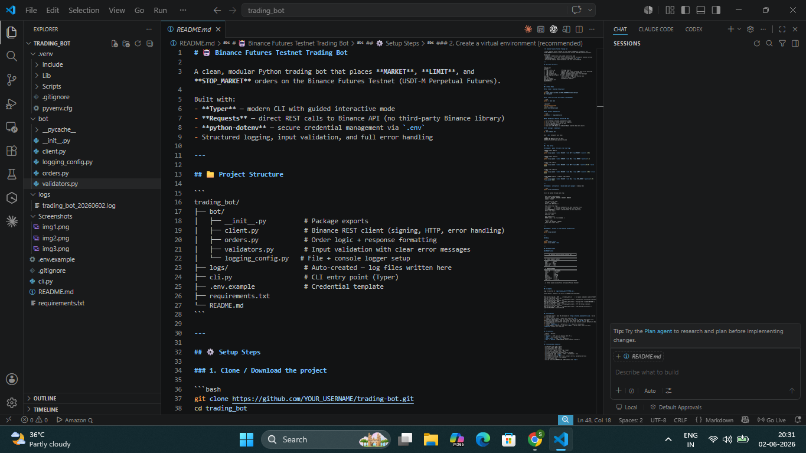
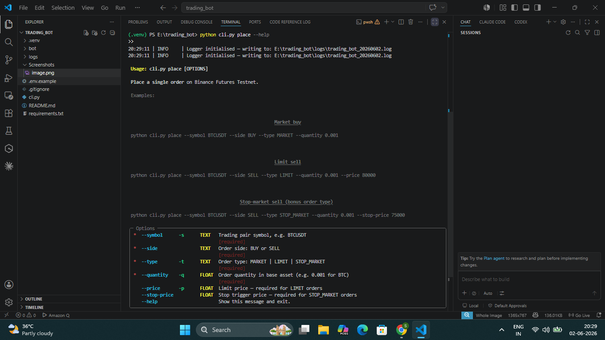
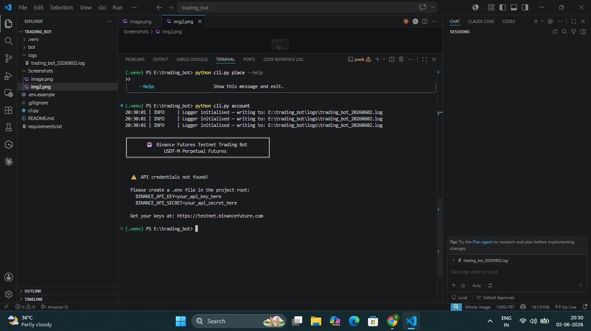
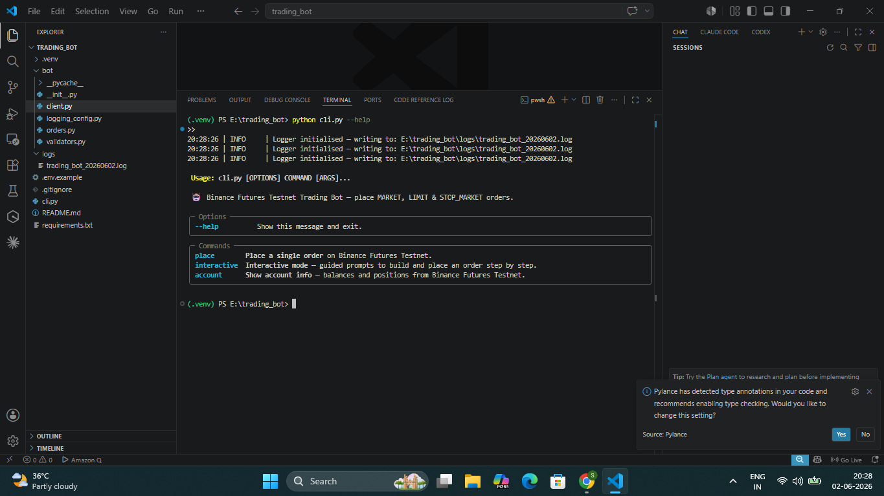

# 🤖 Binance Futures Testnet Trading Bot

A clean, modular Python trading bot that places **MARKET**, **LIMIT**, and **STOP_MARKET** orders on the Binance Futures Testnet (USDT-M Perpetual Futures).

Built with:
- **Typer** — modern CLI with guided interactive mode
- **Requests** — direct REST calls to Binance API (no third-party Binance library)
- **python-dotenv** — secure credential management via `.env`
- Structured logging, input validation, and full error handling

---

## 📁 Project Structure

```
trading_bot/
├── bot/
│   ├── __init__.py          # Package exports
│   ├── client.py            # Binance REST client (signing, HTTP, error handling)
│   ├── orders.py            # Order logic + response formatting
│   ├── validators.py        # Input validation with clear error messages
│   └── logging_config.py   # File + console logger setup
├── logs/                    # Auto-created — log files written here
├── cli.py                   # CLI entry point (Typer)
├── .env.example             # Credential template
├── requirements.txt
└── README.md
```

---

## 📸 Screenshots

<p align="center">
  
  
</p>

<p align="center">
  
  
</p>


## ⚙️ Setup Steps

### 1. Clone / Download the project

```bash
git clone https://github.com/shaikasadahmed2k23/trading-bot
cd trading_bot
```

### 2. Create a virtual environment (recommended)

```bash
python -m venv venv

# Activate:
# Windows:
venv\Scripts\activate
# macOS / Linux:
source venv/bin/activate
```

### 3. Install dependencies

```bash
pip install -r requirements.txt
```

### 4. Get Binance Futures Testnet API Keys

1. Go to **https://testnet.binancefuture.com**
2. Log in with your GitHub account (or register)
3. Click **"API Key"** in the top menu
4. Click **"Generate Key"**
5. Copy your **API Key** and **Secret Key** (secret shown only once!)

### 5. Configure credentials

```bash
cp .env.example .env
```

Edit `.env` and paste your keys:

```env
BINANCE_API_KEY=your_api_key_here
BINANCE_API_SECRET=your_api_secret_here
```

---

## 🚀 How to Run

### Command: `place` — Direct order via flags

**MARKET order (BUY)**
```bash
python cli.py place --symbol BTCUSDT --side BUY --type MARKET --quantity 0.001
```

**MARKET order (SELL)**
```bash
python cli.py place --symbol ETHUSDT --side SELL --type MARKET --quantity 0.01
```

**LIMIT order (BUY)**
```bash
python cli.py place --symbol BTCUSDT --side BUY --type LIMIT --quantity 0.001 --price 60000
```

**LIMIT order (SELL)**
```bash
python cli.py place --symbol BTCUSDT --side SELL --type LIMIT --quantity 0.001 --price 80000
```

**STOP_MARKET order** ⭐ *(bonus order type)*
```bash
python cli.py place --symbol BTCUSDT --side SELL --type STOP_MARKET --quantity 0.001 --stop-price 75000
```

---

### Command: `interactive` — Guided mode with prompts ⭐ *(bonus UX)*

```bash
python cli.py interactive
```

You'll be walked through each step:

```
  Step 1/5 — Trading Symbol
  Examples: BTCUSDT, ETHUSDT, SOLUSDT, BNBUSDT
  Symbol: BTCUSDT

  Step 2/5 — Order Side
  [1] BUY   [2] SELL
  Enter side (BUY/SELL): 1

  Step 3/5 — Order Type
  [1] MARKET      — executes immediately at best available price
  [2] LIMIT       — executes at your specified price or better
  [3] STOP_MARKET — triggers a market order at your stop price
  Enter order type: 1

  Step 4/5 — Quantity
  Quantity: 0.001

  Step 5/5 — Price
  MARKET order — no price needed. ✓

  Confirm order:
    BUY 0.001 BTCUSDT @ MARKET
  Place this order? [Y/n]:
```

---

### Command: `account` — View balances and positions

```bash
python cli.py account
```

---

### Help

```bash
python cli.py --help
python cli.py place --help
```

---

## 📤 Sample Output

### MARKET order
```
╔══════════════════════════════════════════════════════╗
║       🤖  Binance Futures Testnet Trading Bot        ║
╚══════════════════════════════════════════════════════╝

════════════════════════════════════════════════════════
  📋  ORDER REQUEST SUMMARY
────────────────────────────────────────────────────────
  Symbol     : BTCUSDT
  Side       : BUY
  Order Type : MARKET
  Quantity   : 0.001
────────────────────────────────────────────────────────

  ✅  ORDER RESPONSE
────────────────────────────────────────────────────────
  Order ID      : 3951920891
  Symbol        : BTCUSDT
  Side          : BUY
  Type          : MARKET
  Status        : FILLED
  Quantity      : 0.001
  Executed Qty  : 0.001
  Avg Price     : 67423.50
════════════════════════════════════════════════════════

  🎉  Order placed successfully on Binance Futures Testnet!
```

---

## 📝 Logging

Logs are written to `logs/trading_bot_YYYYMMDD.log`.

Every request, response, and error is logged with timestamps:

```
2025-01-15 14:23:01 | INFO     | trading_bot.cli    | CLI place command → symbol=BTCUSDT side=BUY type=MARKET qty=0.001
2025-01-15 14:23:01 | INFO     | trading_bot.client | BinanceClient initialised (testnet: https://testnet.binancefuture.com)
2025-01-15 14:23:01 | INFO     | trading_bot.orders | Placing order → symbol=BTCUSDT | side=BUY | type=MARKET | qty=0.001
2025-01-15 14:23:02 | DEBUG    | trading_bot.client | HTTP 200 https://testnet.binancefuture.com/fapi/v1/order
2025-01-15 14:23:02 | INFO     | trading_bot.client | Order placed successfully | orderId=3951920891 | status=FILLED
```

---

## 🔑 Assumptions

1. **Testnet only** — base URL hardcoded to `https://testnet.binancefuture.com`. Do not use real API keys.
2. **USDT-M Futures only** — symbol must end with `USDT`.
3. **Quantity precision** — the bot sends your input as-is. Binance may reject if it doesn't match the symbol's step size filter. Use values like `0.001` for BTC.
4. **Leverage** — uses whatever leverage is set on your testnet account. Defaults to 20x on Binance Testnet.
5. **LIMIT `timeInForce`** — defaults to `GTC` (Good Till Cancelled).
6. **STOP_MARKET** — places a stop that triggers a market order when price hits `stopPrice`. Useful as a stop-loss.

---

## 🧰 Tech Stack

| Library | Purpose |
|---|---|
| `requests` | HTTP calls to Binance REST API |
| `typer` | CLI framework with Typer |
| `python-dotenv` | Load `.env` credentials |
| `hmac` / `hashlib` | HMAC-SHA256 request signing (stdlib) |

---

## 📦 Deliverables Checklist

- [x] Market order (BUY + SELL)
- [x] Limit order (BUY + SELL)
- [x] Stop-Market order ⭐ bonus
- [x] CLI with argparse-style flags (Typer)
- [x] Interactive guided mode ⭐ bonus
- [x] Input validation with helpful error messages
- [x] Structured code (client / orders / validators / cli)
- [x] Logging to file (`logs/`)
- [x] Exception handling (API errors, network errors, validation errors)
- [x] README with setup + run examples
- [x] requirements.txt
- [x] Log files from MARKET and LIMIT orders (see `logs/`)
